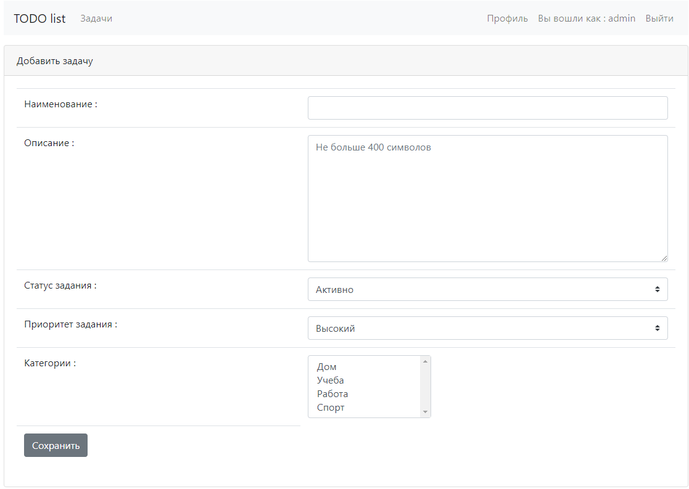
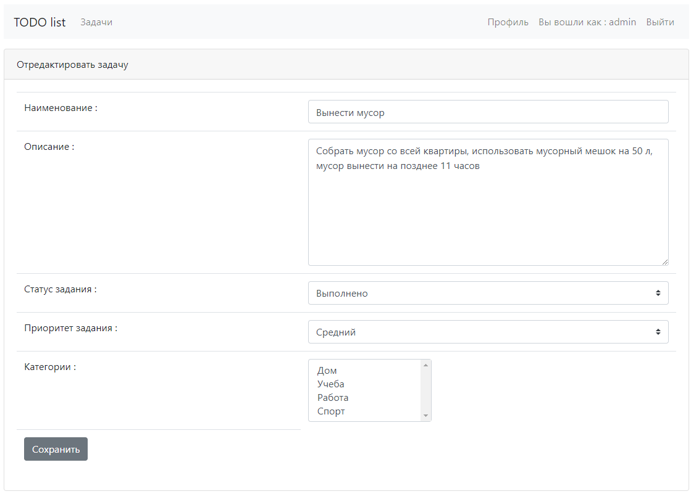

# job4j_todo

# **Проект - Список задач**

<pd id="start">

<ul>
<li><a href="#Описание проекта">Описание проекта</a></li>
<li><a href="#Стек технологий">Стек технологий</a></li>
<li><a href="#Требования к окружению">Требования к окружению</a></li>
<li><a href="#Сборка и запуск проекта">Сборка и запуск проекта</a></li>
<li><a href="#Взаимодействие с приложением">Взаимодействие с приложением</a></li>
<li><a href="#Контакты">Контакты</a></li>
</ul>

## 
Описание проекта

* Добавление дел, проставление отметок о выполнении, редактирование.
* Возможность отображения всех дел, новых или только невыполненных.

<a href="#Описание проекта">К оглавлению</a>

## 
Стек технологий

- Java 17
- Spring Boot 2.7
- Thymeleaf
- Bootstrap
- Hibernate 5.6
- PostgreSql 14

<a href="#Описание проекта">К оглавлению</a>

## 
Требования к окружению

<a href="#Описание проекта">К оглавлению</a>

## 
Сборка и запуск проекта

### 
1. Сборка проекта

Команда для сборки в jar:
`mvn clean package -DskipTests`

### 
2. Запуск проекта

Перед запуском проекта необходимо создать базу данных todo
в PostgreSQL, команда для создания базы данных:
`create database todo;`
Средство миграции Liquibase автоматически создаст структуру
базы данных и наполнит ее предустановленными данными.
Команда для запуска приложения:
`mvn spring-boot:run`

<a href="#Описание проекта">К оглавлению</a>

## 
Взаимодействие с приложением

Локальный доступ к приложению осуществляется через любой современный браузер
по адресу `http://localhost:8080/tasks`

### 1. Страница списка задач

На странице списка задач отображаются все задачи. При клике по названию задачи
происходит переход на страницу с подробной информацией о задаче.

При переходе по ссылке 'Новые', в списке задач отображаются невыполненные задачи.

При переходе по ссылке 'Выполнено', в списке задач отображаются выполненные задачи.

### 2. Страница создания задачи

На странице необходимо задать наименование задачи, подробное описание и статус
(по умолчанию задача активна).

### 3. Страница с подробной информацией о задаче

На странице отображается подробное описание задачи, есть возможность перевести
задачу в выполненные (кнопка 'Выполнено'), перейти к редактированию задачи
(кнопка 'Отредактировать') и удалить задачу (кнопка 'Удалить').

### 4. Страница редактирования задачи

Страница аналогична странице по созданию задачи. Редактируются поля задачи:
наименование, подробное описание и статус.

<a href="#Описание проекта">К оглавлению</a>

## 
Контакты

&nbsp;&nbsp;

&nbsp;&nbsp;

<a href="#Описание проекта">К оглавлению</a>
