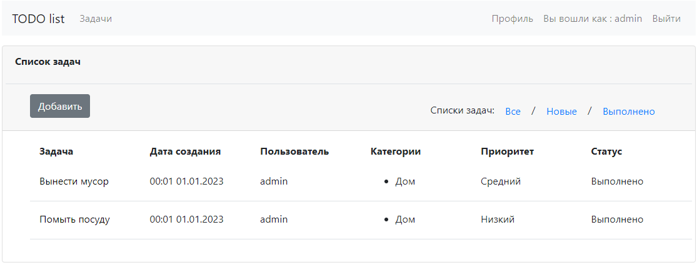

# job4j_todo

# **Проект - Список задач**

## 
Оглавление

<ul>
<li><a href="#01">Описание проекта</a></li>
<li><a href="#02">Стек технологий</a></li>
<li><a href="#03">Требования к окружению</a></li>
<li><a href="#04">Сборка и запуск проекта</a>
    <ol type="1">
        <li><a href="#0401">Сборка проекта</a></li>
        <li><a href="#0402">Запуск проекта</a></li>
    </ol>
</li>
<li><a href="#05">Взаимодействие с приложением</a>
    <ol  type="1">
        <li><a href="#0501">Страница регистрации</a></li>
        <li><a href="#0502">Страница входа</a></li>
        <li><a href="#0503">Страница списка задач</a></li>
        <li><a href="#0504">Страница создания задачи</a></li>
        <li><a href="#0505">Страница с подробной информацией о задаче</a></li>
        <li><a href="#0506">Страница редактирования задачи</a></li>
        <li><a href="#0507">Редактирование профиля</a></li>
        <li><a href="#0508">Выход из приложения</a></li>
    </ol>
</li>
<li><a href="#contacts">Контакты</a></li>
</ul>

## 
Описание проекта

* Добавление дел, проставление отметок о выполнении, редактирование.
* Возможность отображения всех дел, новых или только невыполненных.

<a href="#contents">К оглавлению</a>

## 
Стек технологий

- Java 17
- Spring Boot 2.7
- HTML 5, Thymeleaf, Bootstrap 4
- Hibernate 5.6
- PostgreSql 14
- JUnit 5

Инструменты:

- Javadoc, JaCoCo, Checkstyle

<a href="#contents">К оглавлению</a>

## 
Требования к окружению

Java 17, Maven 3.8, PostgreSQL 14

<a href="#contents">К оглавлению</a>

## 
Сборка и запуск проекта

### 
1. Сборка проекта

Команда для сборки в jar:
`mvn clean package -DskipTests`

<a href="#contents">К оглавлению</a>

### 
2. Запуск проекта

Перед запуском проекта необходимо создать базу данных todo
в PostgreSQL, команда для создания базы данных:
`create database todo;`
Средство миграции Liquibase автоматически создаст структуру
базы данных и наполнит ее предустановленными данными.
Команда для запуска приложения:
`mvn spring-boot:run`

<a href="#contents">К оглавлению</a>

## 
Взаимодействие с приложением

Локальный доступ к приложению осуществляется через любой современный браузер
по адресу `http://localhost:8080/tasks`

### 
1. Страница регистрации

На странице регистрации пользователю необходимо заполнить поля:
Имя, электронная почта, дважды ввести пароль.

При несоблюдении требований к данных формы, на странице регистрации
будут отражены замечания.

<a href="#contents">К оглавлению</a>

### 
2. Страница входа

На странице входа необходимо указать адрес электронной почты и
ввести свой пароль.

При неправильных учетных данных, об этом будет выведено
сообщение на странице входа.

<a href="#contents">К оглавлению</a>

### 
3. Страница списка задач

На странице списка задач отображаются все задачи. При клике по названию задачи
происходит переход на страницу с подробной информацией о задаче.

При переходе по ссылке 'Новые', в списке задач отображаются невыполненные задачи.

При переходе по ссылке 'Выполнено', в списке задач отображаются выполненные задачи.

<a href="#contents">К оглавлению</a>

### 
4. Страница создания задачи

На странице необходимо задать наименование задачи, подробное описание, статус, 
приоритет и выбрать одну или несколько категорий.
По умолчанию задача будет активна.

<a href="#contents">К оглавлению</a>

### 
5. Страница с подробной информацией о задаче

На странице отображается подробное описание задачи, есть возможность перевести
задачу в выполненные (кнопка 'Выполнено'), перейти к редактированию задачи
(кнопка 'Отредактировать') и удалить задачу (кнопка 'Удалить').

Если пользователь заходит не в свою задачу, раздел с действиями на странице
отсутствует.

<a href="#contents">К оглавлению</a>

### 
6. Страница редактирования задачи

Страница аналогична странице по созданию задачи. 

<a href="#contents">К оглавлению</a>

### 
7. Редактирование профиля

На странице редактирования профиля можно изменить: имя, пароль, 
установить временную зону пользователя, при регистрации временная
зона равна 'Europe/London'.

Проверка новых значений данных пользователя происходит по правилам регистрации
и аналогичным выводом ошибок заполнения в соответствующие поля.

<a href="#contents">К оглавлению</a>

### 
8. Выход из приложения

При нажатии в панели навигации на ссылку "Выход", происходит
выход пользователя из приложения с перенаправлением на страницу входа и
сообщением о том, что пользователь вышел. При выходе сессия в которой работал
пользователь удаляется.

<a href="#contents">К оглавлению</a>

## 
Контакты

&nbsp;&nbsp;

&nbsp;&nbsp;

<a href="#contents">К оглавлению</a>
